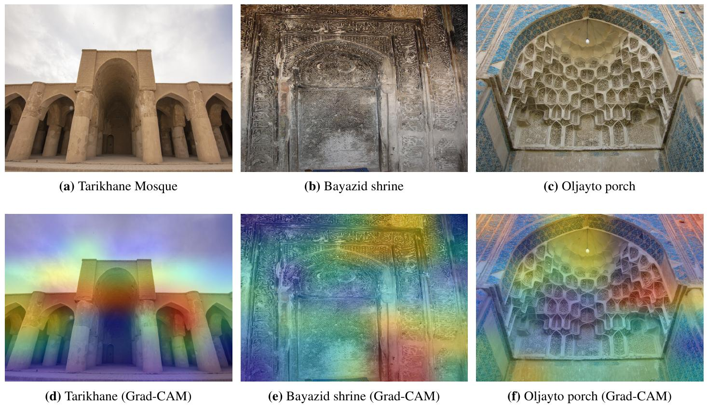
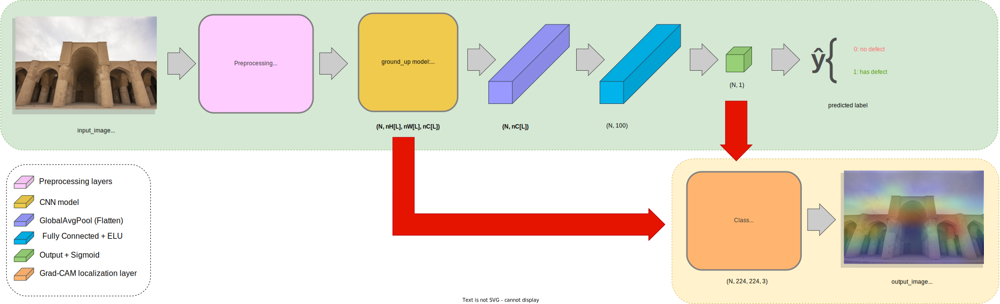
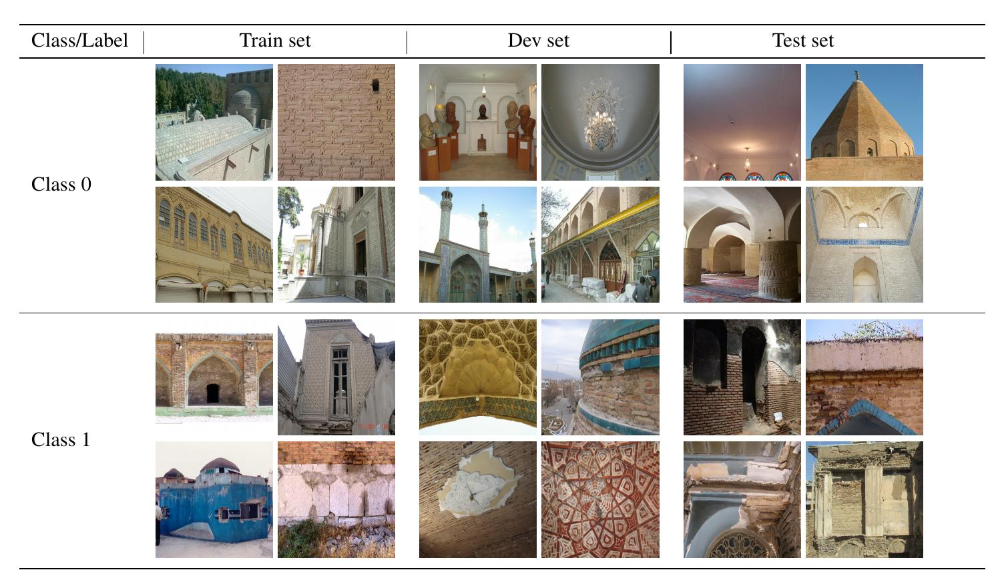
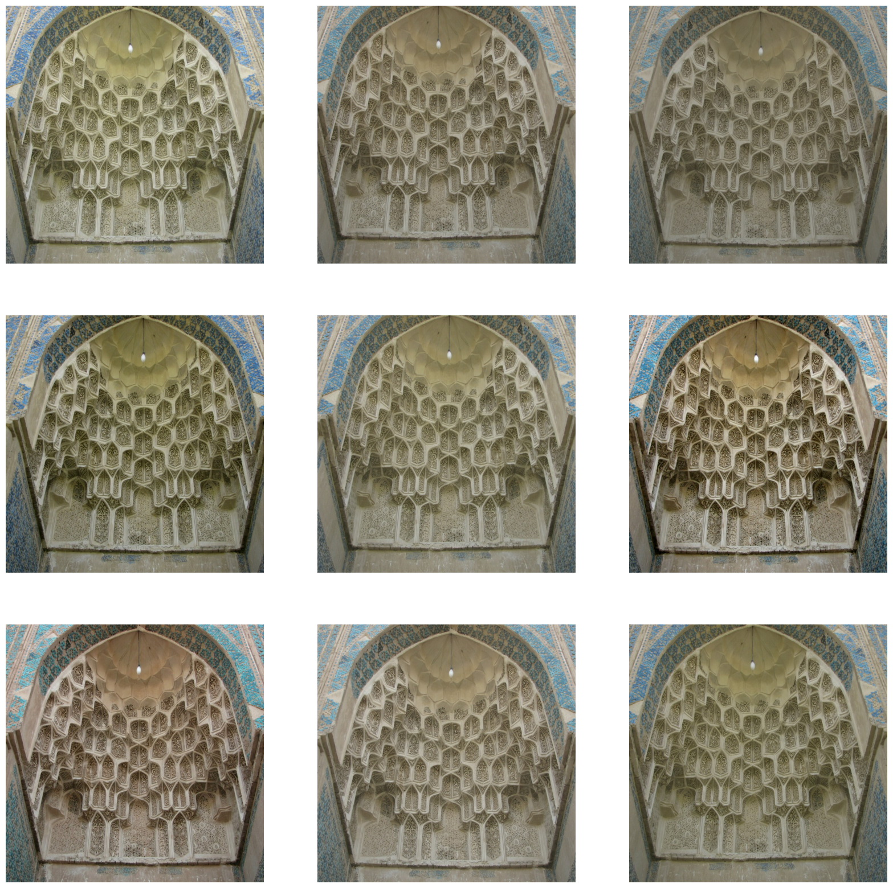

<div align="center">
  <p>
    <a align="center" href="" target="_blank">
      
    </a>
  </p>
  <br>

  <div align="center">
      <a href="https://github.com/tekboart/">
          
      </a>&nbsp;&nbsp;&nbsp;
      <a href="https://www.linkedin.com/in/kyan-bhr/">
          
      </a>&nbsp;&nbsp;&nbsp;
      <a href="https://scholar.google.com/citations?user=r3xmjQUAAAAJ&hl=en">
          
      </a>&nbsp;&nbsp;&nbsp;
      <a href="https://www.kaggle.com/tekboart">
          
      </a>&nbsp;&nbsp;&nbsp;
  </div>
</div>

<hr height="10">

# Deep Learning for Identifying Iran's Cultural Heritage Buildings in Need of Conservation Using Image Classification and Grad-CAM


This repository contains the code and data of an eponymous paper. In an endeavor to practically demonstrate the utilities of DL in CH literature, We developed a fully fledged DL model that classifies the images in need of conservation and even more approximately localizes the defects to help the CH practitioners identify defects in a timely manner, and as a result speed of the process of CHB conservation as well as increasing its accuracy. In spite of all the limitations, we achieved very good results with a score of at least 94% for Precision, Recall, and F1-Score, which were about 4-5% more than similar works (See Table 4 in the preprint v1).

- You can download the preprint version of the paper from [](https://arxiv.org/abs/2302.14354)


<!-- add the link to final version -->
<!-- - The final published version of our paper (after peer-review):

[Deep Learning for Identifying Iran's Cultural Heritage Buildings in Need of Conservation Using Image Classification and Grad-CAM](<add the link to ACM journal>), ACM (JOCCH) 2023. -->


## Requirements


- Please refer to the file `requirements.txt` for a comprehesive list of packages and their corresponding version.

## Project Dir Structure
```bash
.
├── data
│   ├── NO restoration
│   └── YES restoration
├── images
│   └── logos
├── logs
├── models
├── outputs
│   ├── Feature Maps visualization
│   ├── Grad_CAM outputs
│   └── inference
├── Reports
└── utils

13 directories
```

## Pipeline Schema


## Data
- We have two/2 classes, namely (1) no restoration (class 0) and (2) need restoration (class 1) (See Fig [[1]](#1) ).
- Download the dataset [here](https://paperswithcode.com/paper/deep-learning-for-identifying-iran-s-cultural).
  >  The entire dataset will be avaible to download (in the foreseeable future)!
- For the detail regarding how the raw data are processed, please refer the `utils/data_augmentation.py`. (See Fig [[2]](#2) )

<p align="center">
    
    <p align="center"><b>Fig <a id="1">[1]</a> :</b> A few sample images which show the complexity, diversity and variation of our data.</p>
</p>

<p align="center">
    
    <p align="center"><b>Fig <a id="2">[2]</a> :</b> An example of applying the proposed data augmentation methods on a train image (i.e., nine times). Notice how random, realistic, and valid the augmented versions are.</p>
</p>

<!-- ## Running pretrained models
For running a pre-trained model, please follow the steps below:
- The pre-trained models are located at `models/<name_of_the_model/saved_models/`
- Run `inference.py`
- Check out the results in the `outputs/inference/` dir. -->

<!-- ## Training models
For training a model from scratch, please follow the steps below:
- Follow the steps in Data section.
- run ```python train.py ```. Customized arguments can be set according to ```train_args.py```.
- Check out ```output``` and ```checkpoints``` folders for intermediate outputs and checkpoints, respectively. They are under the ```runs/run_id/``` where run_id is the serial number of the
 experiment. -->

## Citation
```latex
@article{bahrami2023deep,
      title={Deep Learning for Identifying Iran's Cultural Heritage Buildings in Need of Conservation Using Image Classification and Grad-CAM},
      author={Mahdi Bahrami and Amir Albadvi},
      year={2023},
      doi={10.48550/arXiv.2302.14354},
      archivePrefix={arXiv},
      primaryClass={cs.CV}
}
}
```

## Contact
<!-- Unfortunately this repo is no longer actively maintained.  -->
Should you have any questions, feel free to contact TekBoArt @tekboart.


## License
<!-- Creative Common Licenses -->
<!-- "Creative Commons Attribution-NonCommercial-ShareAlike (CC-BY-NC-SA)" -->
Shield: [![CC BY-NC-SA 4.0][cc-by-nc-sa-shield]][cc-by-nc-sa]

<!-- MIT License (can be used commercially) -->
<!-- Shield: [](https://opensource.org/licenses/MIT) -->

- Refer to the file `LICENSE` for more information regarding the license of this repository.

This work is licensed under a
[Creative Commons Attribution-NonCommercial-ShareAlike 4.0 International License][cc-by-nc-sa].

[![CC BY-NC-SA 4.0][cc-by-nc-sa-image]][cc-by-nc-sa]

[cc-by-nc-sa]: http://creativecommons.org/licenses/by-nc-sa/4.0/
[cc-by-nc-sa-image]: https://licensebuttons.net/l/by-nc-sa/4.0/88x31.png
[cc-by-nc-sa-shield]: https://img.shields.io/badge/License-CC%20BY--NC--SA%204.0-lightgrey.svg
